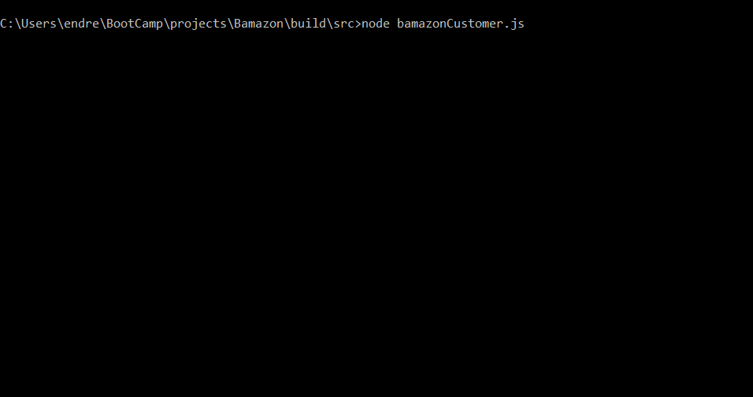
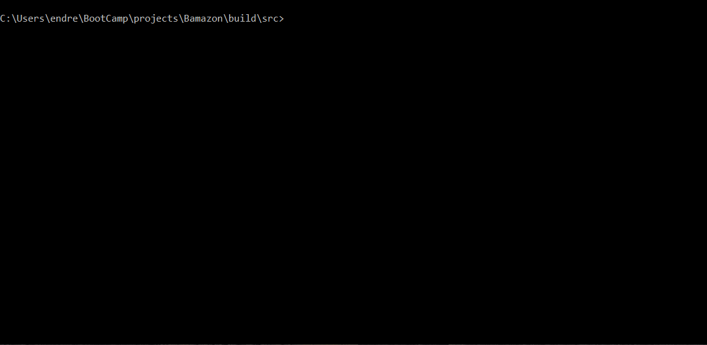
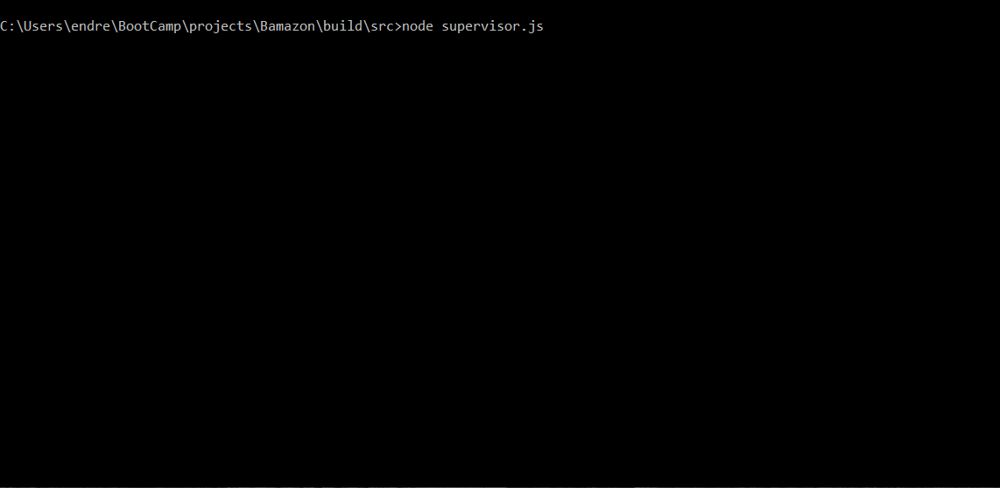

# Bamazon

## Description
Node.js command line interface simulating a "Amazon" like store.

## Motivation 
This project can be a starting point for a product store backend with CRUD operations implemented. 

## Results
There are three levels of interaction with the Bamazon store: customers, managers, and supervisors, all of which use the command line. Bamazon uses SQL to communicate to a MySQL database, which stores a products table and a departments table. The node.js mysql package allows communication between node and the database.

## Available actions
* Customers choose which product and how much to purchase, and view a purchase receipt.
* Managers view all products, low stock products, increase inventory for existing produts, and add new products.
* Supervisors view department information and add new departments.

## Installation
```
git clone <Word-Guess-Game url>
cd path/to/Word-Guess-Game
(You may have to run 'npx gts init')
npm install
```
  
## Compile typescript to javascript
```
npm run compile
```

## Run 
```
cd build/src
```
Choose from one of the three files:
```
bamazonCustomer.js
bamazonManager.js
supervisor.js
```

## Examples

### bamazonCustomer.js


### bamazonManager.js


### supervisor.js
